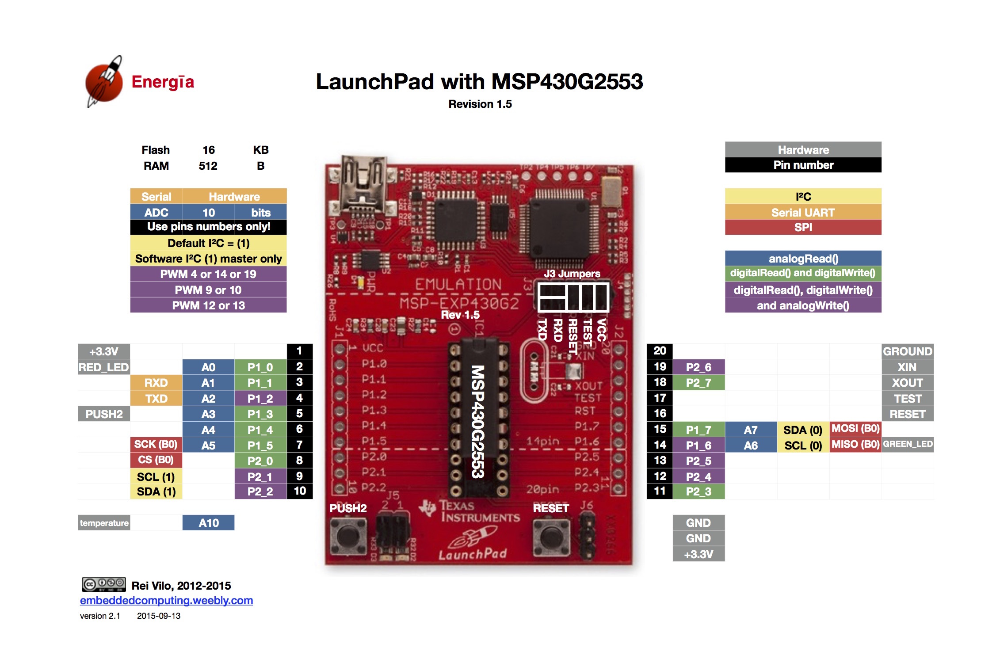

# MSP430 patched version of LiquidCrystal-I2C

Patch consist of a simple trick to tell the library to use the native I2C
module of the MSP430 G2553 using the following call:

    Wire.setModule(0);

The I2C is mapped to pins 1.6 and 1.7 as showed by the following schema:

Note that since pin 1.6 is also wired to GREEN_LED, you will have to remove the
green led jumper because it *will* interfere with I2C signal, although the
idea of seeing this led flash during I2C communications seemed fun at first.

You will also need to add external pull-up resistors for both SDA and SCL.
Something like 2.2k to the 3.3V line worked for me.
